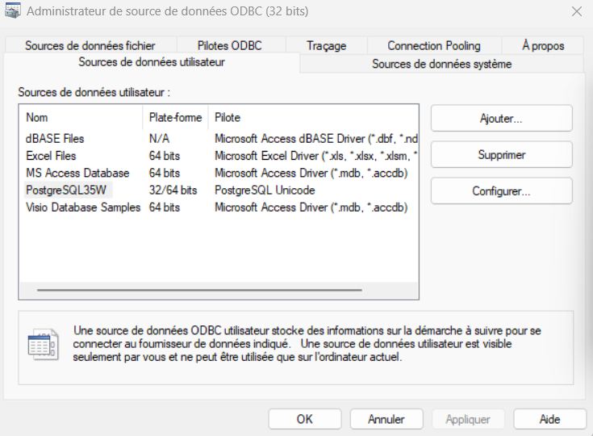
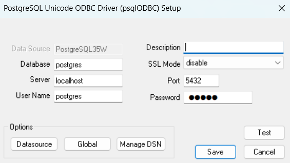
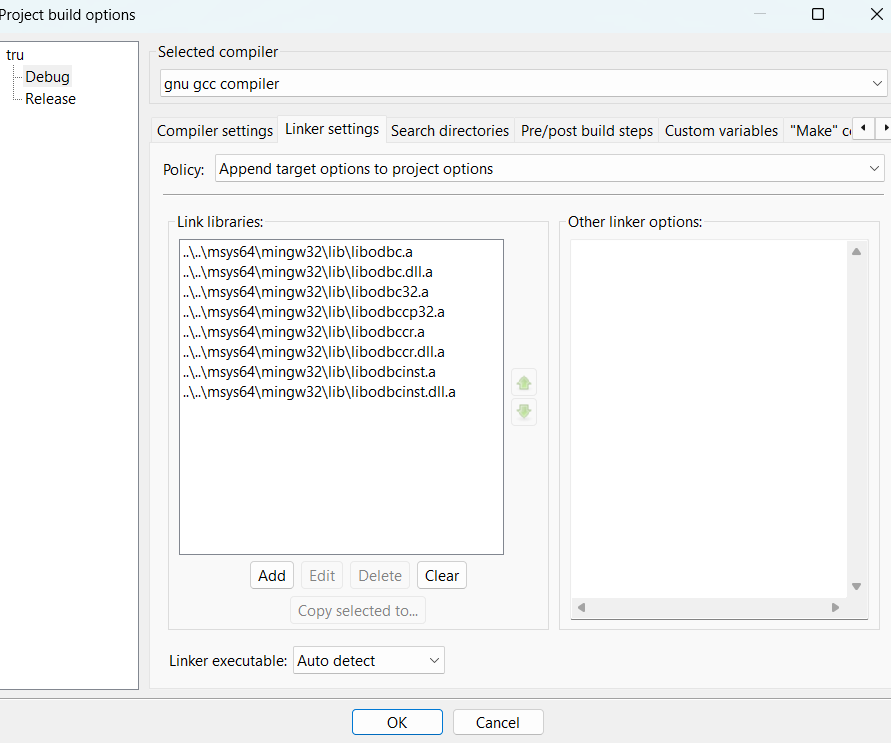

# Data_Send_SQL - C++ Project: PostgreSQL ODBC Integration

This project demonstrates how to connect to a PostgreSQL database using ODBC in a C++ application. It uses Code::Blocks as the IDE and MSYS2 MinGW32 for compilation. The project includes functionality to insert and manage data in a PostgreSQL database.

## Features
- **ODBC Integration**: Connects to PostgreSQL using ODBC.
- **Data Insertion**: Inserts records into a PostgreSQL table.
- **Error Handling**: Robust error handling for database operations.
- **Cross-Platform**: Works on Windows with MSYS2 MinGW32 and Code::Blocks.

## Prerequisites
Before running the project, ensure you have the following installed:
1. **Code::Blocks**: Installed and configured with MinGW32.
2. **MSYS2**: For MinGW32 and package management.
3. **PostgreSQL**: Installed and running on your machine.
4. **ODBC Driver**: Configured for PostgreSQL.

## Installation

### 1. Set Up MSYS2 and MinGW32
- Install MSYS2 from the [MSYS2 Website](https://www.msys2.org/).
- Update the package manager:

    ```bash
    pacman -Syu
    ```

- Install MinGW32 and required libraries:

    ```bash
    pacman -S mingw-w64-i686-gcc mingw-w64-i686-unixodbc mingw-w64-i686-postgresql
    ```

### 2. Configure ODBC
- Edit the ODBC configuration file :go to windows and tapez ODBC Data sources (32bits):


Server=localhost
Port=5432
Database=your_database_name
User=postgres
Password=your_password
### 3. Set Up PostgreSQL Database
Create the required tables:

```sql
CREATE TABLE IF NOT EXISTS utilisateur (
    id SERIAL PRIMARY KEY,
    nom VARCHAR(100),
    age INT,
    genre VARCHAR(20),
    info VARCHAR(30)
);

CREATE TABLE IF NOT EXISTS utilisateur2 (
    id SERIAL PRIMARY KEY,
    nom VARCHAR(100),
    age INT,
    genre VARCHAR(20)
);

## Setting Up Code::Blocks

Follow the steps below to set up your project in Code::Blocks.


### 1 Configure Compiler Settings
- Go to the **Settings** menu, then select **Compiler**.
- In the **Compiler settings** window:
    - Choose the **GNU GCC Compiler** from the list.
  
#### 2. Linker Settings
- In the **Linker settings** tab, add the following line in the **Link libraries** section:

   
    

